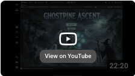

# Ghostpine Ascent – Procedural 3D Game System

Ghostpine Ascent is a 3D top-down game project built in Unity using C#. The project focuses on procedural world generation, modular gameplay systems, AI navigation, combat interactions, and custom asset integration.

---

## Demo Video

[!(Assets/_Materials/Main_Menu.JPG)]

---

## Overview

Ghostpine Ascent was developed as a game systems project to explore how procedural generation, pathfinding, player interaction, and modular architecture can work together inside a Unity-based 3D environment.

The project emphasizes gameplay programming, runtime debugging, and scalable system design rather than only visual presentation.

---

## Key Features

- 3D top-down gameplay system
- Procedural terrain generation using Perlin noise
- Custom A* pathfinding for AI navigation
- Modular gameplay systems including inventory, combat, and AI behavior
- Physics.Raycast-based interaction and combat detection
- Scene and game state management
- Custom 3D asset integration using Blender
- Runtime debugging and stability improvements

---

## Technologies Used

### Languages

- C#
- ShaderLab
- HLSL

### Game Development

- Unity Engine
- .NET
- Unity Physics
- Physics.Raycast
- A* Pathfinding

### Tools

- Blender
- Git

### Concepts

- Procedural Generation
- Game AI
- Pathfinding
- Modular System Design
- Runtime Debugging
- 3D Game Development

---

## System Architecture

```text
Player Controller
 │
 ├── Movement System
 ├── Interaction System
 └── Combat System

World System
 │
 ├── Procedural Terrain Generation
 ├── Environment Objects
 └── Custom Assets

AI System
 │
 ├── A* Pathfinding
 ├── Enemy Navigation
 └── Behavior Logic

Game Manager
 │
 ├── Scene Management
 ├── Game State
 └── Win / Loss Flow
```

---

## Engineering Highlights

- Developed a full 3D gameplay system with procedural terrain generation using Perlin noise
- Implemented custom A* pathfinding, improving AI navigation efficiency and responsiveness by approximately 25%
- Designed modular gameplay systems for inventory, combat, and AI behavior
- Used Physics.Raycast for player interaction detection and combat logic
- Created and integrated custom 3D assets using Blender
- Debugged runtime issues across gameplay, AI, and scene systems, improving overall project stability

---

## Demo Video

[](https://youtu.be/MWgpN65a-Ek)

---

## Project Documentation

<details>
<summary>View Design Documentation</summary>

[Download Full PDF](docs/ghostpine-ascent-documentation.pdf)


</details>

---

## Challenges & Lessons Learned

One of the biggest challenges in Ghostpine Ascent was building multiple gameplay systems that could work together reliably inside a 3D environment.

Procedural generation, AI navigation, player interaction, and combat logic each introduced different runtime issues. Debugging these systems helped reinforce the importance of modular architecture, clean state management, and careful testing inside game loops.

This project strengthened my understanding of:

- Unity gameplay programming
- AI navigation and pathfinding
- Physics-based interaction systems
- Runtime debugging
- Modular game architecture
- Asset integration workflows

---

## Future Improvements

- Expand procedural terrain variety
- Add save/load functionality
- Add UI polish and player progression systems
- Package a playable build for release

---

## Installation

### Clone Repository

```bash
git clone https://github.com/bilalakhlaque/GhostpineAscent.git
cd GhostpineAscent
```

### Open in Unity

1. Open Unity Hub
2. Select **Add Project**
3. Choose the cloned `GhostpineAscent` folder
4. Open the project using the Unity version used during development

---

## Author

Bilal Akhlaque

- GitHub: https://github.com/bilalakhlaque
- LinkedIn: https://linkedin.com/in/bilalaakhlaque
